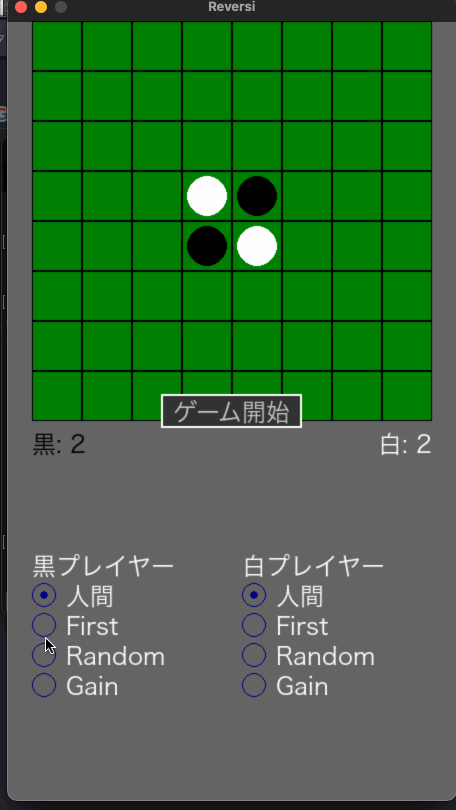

# Reversi (リバーシ) - Python & Pygame



## 概要

このプロジェクトは、Python と Pygame を使用して開発されたリバーシゲームです。人間同士の対戦はもちろん、人間対AI、AI対AIの対戦も楽しめます。3種類のAIエージェントが実装されており、それぞれ異なる戦略で対戦します。

## 特徴

*   **直感的な操作:** マウス操作で簡単に石を置くことができます。
*   **多彩な対戦モード:** 人間対人間、人間対AI、AI対AIの対戦が可能です。
*   **４種類のAIエージェント:**
    *   **FirstAgent:** 合法手の中で最初に見つかった手を置くシンプルなAI。
    *   **RandomAgent:** 合法手の中からランダムに手を選ぶAI。
    *   **GainAgent:** ひっくり返せる石の数が最大になる手を選ぶ戦略的なAI。
    *   **MonteCarloTreeSearchAgent (MCTS):** モンテカルロ木探索を用いて、より強力な手を選択するAI。
*   **ゲーム履歴:** ゲームの進行を履歴として保存し、←キーと→キーで履歴を戻ったり進んだりできます。
*   **アニメーション:** 石を置く、ひっくり返すなどのアニメーションが実装されており、視覚的に楽しめます。
*   **リスタート機能:** ゲームをリスタートすることができます。
*   **ゲーム開始機能:** ゲーム開始ボタンでゲームを開始することができます。
*   **日本語対応:** 日本語のメッセージやフォントに対応しています。
*   **ユニットテスト:** ユニットテストが実装されており、コードの品質を保っています。
*   **パス機能:** 合法手がない場合、自動的にパスします。

## 動作環境

*   Python 3.7 以上
*   Pygame

## インストール

1.  リポジトリをクローンします。

    ```bash
    git clone https://github.com/your-username/reversi-py.git
    ```

2.  必要なライブラリをインストールします。

    ```bash
    pip install pygame
    ```

## 実行方法

1.  プロジェクトのルートディレクトリに移動します。

    ```bash
    cd reversi-py
    ```

2.  `main.py` を実行します。

    ```bash
    python3 main.py
    ```

## 使い方

*   **ゲーム開始:** 画面中央の「ゲーム開始」ボタンをクリックします。
*   **石を置く:** 合法手が表示されているマスをクリックします。
*   **リスタート:** ゲーム中またはゲームオーバー時に画面下部の「リスタート」ボタンをクリックします。
*   **ゲーム履歴:** ←キーで履歴を戻り、→キーで履歴を進みます。

## AIエージェントの詳細

このゲームには、以下の3種類のAIエージェントが実装されています。

*   **FirstAgent:** 合法手の中で最初に見つかった手を置きます。最も単純なAIです。
*   **RandomAgent:** 合法手の中からランダムに手を選びます。予測不能な動きが特徴です。
*   **GainAgent:** ひっくり返せる石の数が最大になる手を選びます。より戦略的な思考を持つAIです。

## テスト

テストを実行するには、以下のコマンドを使用します。

```bash
python -m unittest discover -s tests -t .
```

## テストカバレッジの計測
テストカバレッジを計測するには、coverage.py を使用します。

coverage.py をインストールします。

```bash
pip install coverage
```

カバレッジ計測付きでテストを実行します。

```bash
python3 -m coverage run -m unittest discover -s tests -t .ß
```

テキスト形式のカバレッジレポートを生成します。

```bash
python3 -m coverage report -m
```

HTML形式のカバレッジレポートを生成します。

```bash
python3 -m coverage html
```

HTMLレポートは htmlcov ディレクトリに生成されます。htmlcov/index.html をブラウザで開いて確認してください。

カバレッジレポートを削除します。

```bash
python3 -m coverage erase
```

## ファイル構成

```
reversi-py/
├── agents/             # AIエージェント関連のモジュール
│   ├── __init__.py
│   ├── base_agent.py   # エージェントの基底クラス
│   ├── first_agent.py  # 最初の有効な手を選択するエージェント
│   ├── random_agent.py # ランダムに有効な手を選択するエージェント
│   ├── gain_agent.py   # 獲得数が最大になる手を選択するエージェント
│   └── mcts_agent.py   # モンテカルロ木探索エージェント
├── board.py            # ボードのロジック (石の配置、合法手の判定など)
├── config/             # 設定ファイル
│   └── theme.py        # 色や画面サイズなどのテーマ設定
├── game.py             # ゲームのロジック (ターン管理、ゲームオーバー判定など)
├── gui.py              # GUIのロジック (描画、アニメーション、ボタンなど)
├── main.py             # メインプログラム (ゲームの実行)
├── scrennshots/        # スクリーンショット画像
│   └── 000.png
├── tests/
│   ├── agents/         # エージェントのテスト
│   │   ├── __init__.py
│   │   └── test_mcts_agent.py # MCTSエージェントのテスト (他のテストもここへ)
│   ├── __init__.py     # testディレクトリをパッケージとして認識させるため
│   ├── test_board.py   # ボードのテスト
│   ├── test_game.py    # ゲームのテスト
│   └── test_gui.py     # GUIのテスト
├── .gitignore          # Git管理対象外ファイルの設定
├── LICENSE             # ライセンスファイル (存在する場合)
└── README.md           # このファイル

```

## ライセンス

このプロジェクトは MIT ライセンスの下で公開されています。詳細については、LICENSE ファイルを参照してください。
