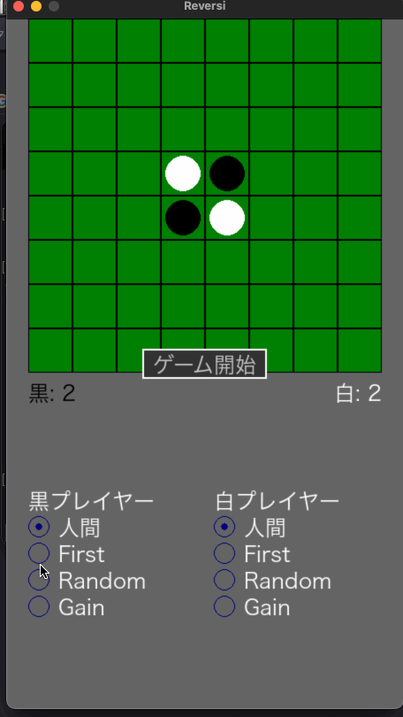
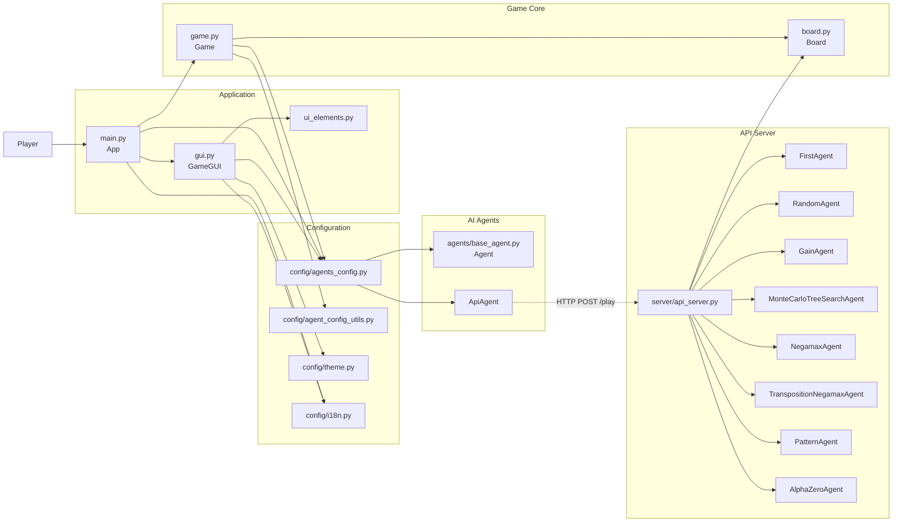
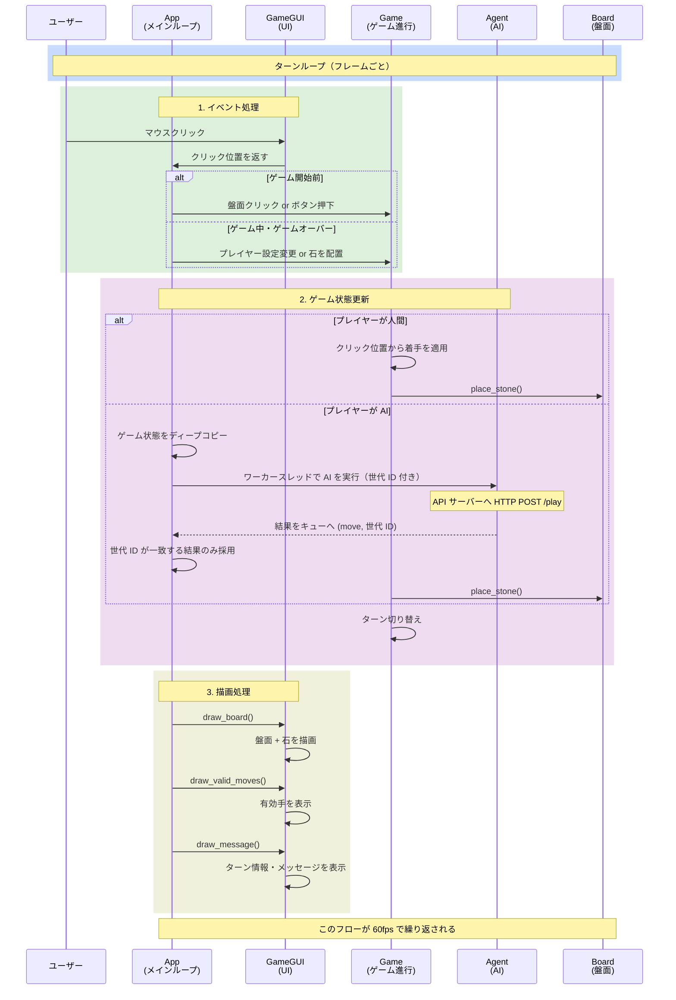

# Reversi (リバーシ) - Python / Pygame



## 概要

Python と Pygame で作られたリバーシゲームです。

- 人間 vs 人間、人間 vs AI、AI vs AI に対応
- **8 種類の AI 戦略**（First / Random / Gain / MCTS / Negamax / TranspositionNegamax / Pattern / AlphaZero）を API サーバー経由で提供
- 「待った」（Undo）、リスタート、リセット、パス処理に対応
- 日本語 UI とフォント設定に対応
- **包括的なテスト体制**: 314 テスト（アプリ + サーバー + 統合 + 強さ検証）、カバレッジ 90%+（Tier 1）/ 100%（単体テスト）
- **AI 強さ検証**: Tier 1（8x8 盤面での高速強さテスト、7 テスト） / Tier 2（詳細ベンチマーク）で複数 AI の強さを確認
- **GitHub Actions CI**: Lint / 型チェック / テスト / Strength テスト / カバレッジ / サーバーテスト

## AI エージェント

プレイヤー設定では、次の選択肢を使えます。

- `人間`
- `API (First)`: 最初に見つかった合法手を選ぶ
- `API (Random)`: 合法手からランダムに選ぶ
- `API (Gain)`: 獲得石数が最大の手を選ぶ
- `API (MCTS)`: モンテカルロ木探索で手を選ぶ
- `API (Negamax)`: αβ枝刈り + 反復深化 + 終盤読み切り（位置重み・着手可能数・確定石で評価）
- `API (Transposition)`: αβ枝刈り + トランスポジションテーブル + PVS + Killer move（同時間で 2-3 倍深く探索）
- `API (Pattern)`: αβ枝刈り + Edax 式パターン評価（エッジ・コーナー・対角線パターン、TD 学習済み）
- `API (AlphaZero)`: MCTS + PyTorch ResNet（自己対戦学習対応）

`API (...)` エージェントはいずれも、`server/api_server.py` で起動する API サーバーから手を取得します。
AI を使う場合は API サーバーの起動が必要です（`./scripts/start_with_server.sh` を推奨）。

## 構成図


```mermaid
flowchart LR
    User[Player]

    subgraph App["Application"]
        Main["main.py<br/>App"]
        GUI["gui.py<br/>GameGUI"]
        UIE["ui_elements.py"]
    end

    subgraph Core["Game Core"]
        Game["game.py<br/>Game"]
        Board["board.py<br/>Board"]
    end

    subgraph Agents["AI Agents"]
        Base["agents/base_agent.py<br/>Agent"]
        API["ApiAgent"]
    end

    subgraph Config["Configuration"]
        AgentsCfg["config/agents_config.py"]
        Params["config/agent_config_utils.py"]
        Theme["config/theme.py"]
        I18n["config/i18n.py"]
    end

    subgraph Server["API Server"]
        APIServer["server/api_server.py"]
        First["FirstAgent"]
        Random["RandomAgent"]
        Gain["GainAgent"]
        MCTS["MonteCarloTreeSearchAgent"]
        Negamax["NegamaxAgent"]
        Transposition["TranspositionNegamaxAgent"]
        Pattern["PatternAgent"]
        AlphaZero["AlphaZeroAgent"]
    end

    User --> Main
    Main --> GUI
    Main --> Game
    Main --> I18n
    Main --> AgentsCfg

    GUI --> UIE
    GUI --> Theme
    GUI --> AgentsCfg
    GUI --> I18n

    Game --> Board
    Game --> AgentsCfg
    Game --> Params

    AgentsCfg --> Base
    AgentsCfg --> API

    API -.->|HTTP POST /play| APIServer
    APIServer --> First
    APIServer --> Random
    APIServer --> Gain
    APIServer --> MCTS
    APIServer --> Negamax
    APIServer --> Transposition
    APIServer --> Pattern
    APIServer --> AlphaZero
    APIServer --> Board
```

## 動作環境

- Python 3.14.2 以上
- Pygame

API サーバーを使う場合は、追加で以下が必要です。

- FastAPI
- Pydantic
- Uvicorn

## インストール

基本環境を入れる場合:

```bash
uv sync
```

API サーバーも使う場合:

```bash
uv sync --extra server
```

開発用ツールも含めて全部入れる場合:

```bash
uv sync --all-extras
```

## クイックスタート

最もシンプルな起動方法：

```bash
./scripts/start.sh
```

API サーバー付きで起動（API エージェント使用可能）:

```bash
./scripts/start_with_server.sh
```

停止用:

```bash
./scripts/stop_with_server.sh
```

API サーバーのみ再起動する場合:

```bash
./scripts/restart_server.sh
```

Docker で起動（VNC で操作）:

```bash
./scripts/docker_start.sh
```

## 実行方法

### Docker を使わない実行（ローカル環境）

#### 方法 1: アプリのみを起動（シンプル）

ゲーム本体をシンプルに起動します。AI エージェントはすべて API サーバー経由のため、この方法では人間 vs 人間のプレイのみが可能です（AI を選択した場合は接続エラーになり、1 秒間隔で再試行します）。

**スクリプトを使う場合:**

```bash
./scripts/start.sh
```

**手動で起動する場合:**

```bash
# uv がインストール済みの場合
uv run python main.py

# Python を直接使う場合
python main.py
```

#### 方法 2: API サーバーとアプリを一緒に起動（AI エージェント使用）

AI エージェント（`API (First)` / `API (Random)` / `API (Gain)` / `API (MCTS)` / `API (Negamax)`）を使う場合、API サーバーとアプリを起動します。

**スクリプトを使う場合（推奨）:**

```bash
./scripts/start_with_server.sh
```

このスクリプトは以下を自動で行います：
- API サーバーをバックグラウンドで起動
- サーバーの起動確認
- アプリケーションを起動
- 終了時に API サーバーも自動停止

別ターミナルで `uv run python -m server.api_server` と `uv run python main.py` を
個別に起動している場合は、`./scripts/stop_with_server.sh` で両方を停止できます。
API サーバーだけを入れ直したい場合は `./scripts/restart_server.sh` を使ってください。

**手動で起動する場合:**

ターミナル 1（API サーバー）:

```bash
# 環境設定（オプション）
export API_HOST=127.0.0.1  # デフォルト: 127.0.0.1
export API_PORT=5001       # デフォルト: 5001

# サーバー起動
uv run python -m server.api_server
```

ターミナル 2（アプリケーション）:

```bash
uv run python main.py
```

起動ログで `Uvicorn running on http://127.0.0.1:5001` が表示されたら正常です。API ドキュメントは http://127.0.0.1:5001/docs で確認できます。

アプリの「プレイヤー設定」でプレイヤーを `API (...)` のいずれかに設定すると、サーバー経由で AI が着手します。

### Docker を使用した実行（コンテナ環境）

Docker を使うと、依存関係やシステム設定に関わらず、どの環境でも同じ状態で実行できます。VNC を使って GUI を操作できます。

#### Docker イメージのビルド

イメージを構築します（初回のみ）。

```bash
docker build -t reversi-py .
```

または、スクリプトを使う場合（イメージの存在確認も行う）:

```bash
./scripts/docker_start.sh
```

#### Docker コンテナの起動

**スクリプトを使う場合（推奨）:**

```bash
./scripts/docker_start.sh
```

スクリプトは以下を行います：
- イメージを構築（存在しない場合）
- 既存コンテナを停止・削除
- コンテナを起動
- ポート設定情報を表示

**手動で起動する場合:**

```bash
docker run -d \
    --name reversi-container \
    -p 5901:5901 \
    -p 5001:5001 \
    -e DISPLAY=:1 \
    reversi-py
```

- `-d`: バックグラウンド実行
- `-p 5901:5901`: VNC ポート（ホスト:コンテナ）
- `-p 5001:5001`: API サーバーポート
- `-e DISPLAY=:1`: X11 ディスプレイ設定

#### VNC での GUI 接続

1. **VNC クライアントを起動**
   - macOS: Finder > 移動 > サーバーへ接続 > `vnc://localhost:5901`
   - Windows: TightVNC、RealVNC など
   - Linux: `vncviewer localhost:5901`

2. **接続情報**
   - ホスト: `localhost` または `127.0.0.1`
   - ポート: `5901`
   - パスワード: `reversi`（Dockerfile で設定）

3. **GUI 操作**
   - VNC 接続後は、ローカル実行と同様にゲームをプレイできます
   - API サーバーも同時に起動されています

#### コンテナの停止・削除

**スクリプトを使う場合:**

```bash
./scripts/docker_stop.sh
```

**手動で停止する場合:**

```bash
# コンテナを停止
docker stop reversi-container

# コンテナを削除
docker rm reversi-container
```

**すべての reversi コンテナを削除する場合:**

```bash
docker ps -a | grep reversi | awk '{print $1}' | xargs docker rm -f
```

#### コンテナ内でのトラブルシューティング

**ログを確認:**

```bash
docker logs -f reversi-container
```

**コンテナにシェルでアクセス:**

```bash
docker exec -it reversi-container bash
```

**API サーバーが起動しているか確認:**

```bash
# コンテナ内から
curl http://localhost:5001/docs

# ホストマシンから
curl http://localhost:5001/docs
```

#### 環境変数のカスタマイズ

Docker 起動時に環境変数を指定できます：

```bash
docker run -d \
    --name reversi-container \
    -p 5901:5901 \
    -p 5001:5001 \
    -e API_HOST=0.0.0.0 \
    -e API_PORT=5001 \
    -e LOG_LEVEL=debug \
    reversi-py
```

## API サーバー

API サーバーを起動すると、`API (...)` エージェントが使えるようになります。

```bash
uv run python -m server.api_server
```

既定の設定は次のとおりです。

- ホスト: `127.0.0.1`
- ポート: `5001`
- ログレベル: `info`

必要に応じて、環境変数で変更できます。

- `API_HOST`
- `API_PORT`
- `LOG_LEVEL`

API ドキュメント:

- Swagger UI: `http://127.0.0.1:5001/docs`
- OpenAPI JSON: `http://127.0.0.1:5001/openapi.json`
- エンドポイント: `POST /play`

### POST /play のリクエスト仕様

```json
{
  "board": [[0, 0, ...], ...],
  "turn": -1,
  "agent_type": "mcts"
}
```

- `board`: 正方形の 2 次元配列（各セルは -1: 黒、0: 空、1: 白）。サイズは 4〜16（DoS 防止の上限あり）
- `turn`: 手番（-1: 黒、1: 白）
- `agent_type`: `first` / `random` / `gain` / `mcts` / `negamax` / `transposition` / `pattern` / `alphazero` のいずれか（省略時は `random`）

レスポンスは `{"move": [row, col]}`、合法手がない場合は `{"move": null}` です。

## 使い方

1. ゲームを起動します
   - シンプル実行: `./scripts/start.sh`
   - API サーバー付き: `./scripts/start_with_server.sh`
   - Docker 使用: `./scripts/docker_start.sh`

2. 画面の「ゲーム開始」ボタンを押します

3. 盤面の合法手をクリックして石を置きます

4. プレイヤー設定で以下を選べます
   - `人間`: 人間が手を指します
   - `API (First)`, `API (Random)`, `API (Gain)`, `API (MCTS)`, `API (Negamax)`: API サーバー経由の AI（サーバー起動が必要）

5. 「待った」ボタンで手を戻せます（AI 対戦時は自分が打つ直前の状態まで戻ります）

## テスト

### 単体テストを実行（通常実行）

統合テストと強さテストを除く単体テスト（サーバー単体テスト含む）を実行します。

```bash
uv run pytest --ignore=tests/integration -q
```

期待: `307 passed, 12 subtests passed` （strength マーカーテスト自動除外）

### サーバー単体テスト

API サーバーのバリデーションテストを実行します（FastAPI TestClient 使用）。

```bash
uv run pytest tests/server/ -v
```

期待: `23 passed` （FastAPI エンドポイント、リクエスト・レスポンスの検証）

### AI 強さ検証テスト

Negamax エージェントの強さを検証する 2 層テスト体制です。

#### Tier 1: 高速強さテスト（CI 組み込み、8x8 盤面）

複数の AI エージェントを 8x8 盤面で検証する 7 つの高速テスト（10 秒以内）。

```bash
# 明示的に実行
uv run pytest -m strength tests/test_strength.py -v
```

期待: `7 passed in X.Xs` （X は 15 秒以内）

**テスト内容:**
- **Negamax（強さテスト）**: GainAgent に対して 2 ゲームで勝利確認
  - `test_negamax_black_wins`: 黒番で勝利（石差 > 0）
  - `test_negamax_white_wins`: 白番で勝利（石差 < 0）
  
- **Transposition**: 初期化・動作確認（8x8 盤面）
  - `test_transposition_initializes`: 正常に初期化される
  - `test_transposition_returns_move`: 合法手を返す
  
- **Pattern**: 初期化・属性確認（8x8 盤面）
  - `test_pattern_initializes`: 正常に初期化される
  - 属性チェック（evaluator 存在確認）
  
- **AlphaZero**: 初期化・動作確認・訓練済みモデル検証
  - `test_alpha_zero_initializes`: 正常に初期化される
  - `test_alpha_zero_returns_move`: 合法手を返す
  - `test_alpha_zero_with_trained_model`: 学習済みモデルで動作する

**注記**: 
- 通常の `uv run pytest` 実行では strength テストは自動除外されます（pytest マーカーで管理）
- CI で `pytest -m strength` を明示的に実行
- Negamax は実際の対戦テスト、Transposition/Pattern/AlphaZero は初期化・動作確認

#### Tier 2: 詳細ベンチマーク（ローカル検証）

Negamax の強さを詳細に検証するベンチマークスクリプト。複数の対戦相手と盤面サイズで評価できます。

```bash
# デフォルト: MCTS 対手、8x8 盤面、10 ゲーム（54 秒）
uv run python scripts/benchmark_agents.py

# GainAgent 対手で高速確認（5 ゲーム、30 秒以内）
uv run python scripts/benchmark_agents.py --opponent gain --games 5

# 詳細検証: MCTS の反復回数と思考時間を増やす
uv run python scripts/benchmark_agents.py --mcts-iterations 100 --time-limit-ms 1000 --games 5
```

受け入れ基準:
- `--opponent mcts` 時: 80% 以上の勝率
- `--opponent gain` / `--opponent random` 時: 60% 以上の勝率

### AlphaZero 訓練（自己対戦学習）

AlphaZero エージェントはニューラルネットワークを使用するため、強さを向上させるには訓練が必要です。自己対戦による学習スクリプトを提供しています。

#### 簡易訓練実行

```bash
# デフォルト: 10 イテレーション訓練、学習済みモデルを models/alpha_zero_latest.pth に保存
uv run python scripts/train_alpha_zero_simple.py
```

訓練の詳細:
- **データ生成**: 各イテレーションで 5 ゲームの自己対戦（GainAgent）を実行
- **ニューラルネットワーク**: ResNet（4 ブロック、32 フィルタ）
- **最適化**: Adam（学習率 1e-3）
- **出力**: チェックポイント `models/alpha_zero_iter*.pth` と最新版 `models/alpha_zero_latest.pth`

#### 訓練済みモデルの確認

```bash
# 訓練済みモデルで GainAgent に対戦（3 ゲーム）
uv run python scripts/test_alpha_zero_strength.py
```

期待: AlphaZero が GainAgent に対して複数回の勝利を獲得（現在は 1/3 wins）。

#### GUI での使用

GUI で「プレイヤー設定」から `API (AlphaZero)` を選択すると、自動的に学習済みモデルが読み込まれます。

**注記:**
- 学習済みモデルが見つからない場合、自動的に未学習モデルで動作します
- AlphaZero の強さを向上させるには、訓練イテレーション数を増やすか、自己対戦データを増やす必要があります
- 現在の実装は教育的な目的を想定しており、本格的な訓練には GPU の利用が推奨されます

### 統合テスト

実際にサーバーを起動してエンドツーエンドテストを実行します。

```bash
uv run pytest tests/integration/ -v
```

期待: `9 passed` （API サーバーの実際の起動、ApiAgent との通信）

### ローカル CI チェック

ローカルで GitHub Actions 相当のすべてのチェックを実行します。

```bash
./scripts/ci_check.sh
```

実行内容:
1. Lint チェック (ruff)
2. 型チェック (mypy)
3. テスト実行 (pytest) — strength テストは自動除外
4. カバレッジ確認 (100%)
5. サーバー単体テスト (FastAPI TestClient)
6. 統合テスト (実サーバー起動)

## アーキテクチャ詳細

### クラス責務の分離

このプロジェクトは **単一責務原則（SRP）** に基づいて設計されています。

| クラス | ファイル | 責務 |
|--------|---------|------|
| **App** | main.py | メインループ、ゲーム状態管理、AI 実行管理、UI イベント処理（4 責務をセクション化で整理）|
| **GameGUI** | gui.py | レイアウト計算、UI 描画、入力処理（37 メソッドを 4 セクション化）|
| **Game** | game.py | ゲーム進行、ターン管理、プレイヤー管理、勝敗判定 |
| **Board** | board.py | 盤面データ、ルール実装（有効手判定、石の反転） |

### コード構成の工夫

各クラスは責務ごとに **セクションコメント** で整理されています：

- **App クラス** (main.py)
  - `# === イベント処理 ===`
  - `# === 状態管理 ===`
  - `# === クリック処理のディスパッチ ===`
  - `# === AI・パス処理 ===`
  - `# === 描画 ===`

- **GameGUI クラス** (gui.py)
  - `# === ヘルパー ===`
  - `# === レイアウト計算・初期化 ===`
  - `# === 描画 ===`
  - `# === 入力処理 ===`

セクション化により、メソッド検索効率が向上し、新規開発者が各責務を一目で理解できます。

### AI 非同期実行の安全機構

AI の思考は UI を固めないようワーカースレッドで実行されます。並行処理に伴う不整合を防ぐため、以下の機構を備えています。

- **世代 ID**: プレイヤー変更・リスタート・リセット・「待った」の際に世代をインクリメントし、古い世代の AI 結果は破棄します
- **状態スナップショット**: AI スレッドにはゲーム状態のディープコピーを渡し、メインスレッドの盤面操作と競合しないようにします
- **再試行バックオフ**: API サーバーに接続できないなど AI が手を返せない場合、1 秒待ってから再試行します（接続ストーム防止）

### 将来の最適化

- **App**: GameController と AIManager への分離を検討
- **GameGUI**: GameLayout クラスの抽出を検討

現在の実装は テスト容易性 と 保守性 のバランスを優先しています。

### ゲーム進行シーケンス

各ターンの処理フローを以下に示します。


```mermaid
sequenceDiagram
    participant User as ユーザー
    participant Main as App<br/>(メインループ)
    participant GUI as GameGUI<br/>(UI)
    participant Game as Game<br/>(ゲーム進行)
    participant Agent as Agent<br/>(AI)
    participant Board as Board<br/>(盤面)

    rect rgb(200, 220, 255)
        Note over User,Board: ターンループ（フレームごと）
    end

    rect rgb(220, 240, 220)
        Note over Main,GUI: 1. イベント処理
        User->>GUI: マウスクリック
        GUI->>Main: クリック位置を返す
        alt ゲーム開始前
            Main->>Game: 盤面クリック or ボタン押下
        else ゲーム中・ゲームオーバー
            Main->>Game: プレイヤー設定変更 or 石を配置
        end
    end

    rect rgb(240, 220, 240)
        Note over Main,Agent: 2. ゲーム状態更新
        alt プレイヤーが人間
            Game->>Game: クリック位置から着手を適用
            Game->>Board: place_stone()
        else プレイヤーが AI
            Main->>Main: ゲーム状態をディープコピー
            Main->>Agent: ワーカースレッドで AI を実行（世代 ID 付き）
            Note over Agent: API サーバーへ HTTP POST /play
            Agent-->>Main: 結果をキューへ (move, 世代 ID)
            Main->>Main: 世代 ID が一致する結果のみ採用
            Game->>Board: place_stone()
        end
        Game->>Game: ターン切り替え
    end

    rect rgb(240, 240, 220)
        Note over Main,GUI: 3. 描画処理
        Main->>GUI: draw_board()
        GUI->>GUI: 盤面 + 石を描画
        Main->>GUI: draw_valid_moves()
        GUI->>GUI: 有効手を表示
        Main->>GUI: draw_message()
        GUI->>GUI: ターン情報・メッセージを表示
    end

    Note over Main,Board: このフローが 60fps で繰り返される
```

## 主要ファイル

### アプリケーション

- `main.py`: アプリケーションのエントリーポイント
- `game.py`: ゲーム進行、履歴、パス、勝敗判定
- `board.py`: 盤面ロジック
- `gui.py`: Pygame GUI
- `agents/`: AI エージェント実装
- `config/agents_config.py`: エージェント定義

### AI エージェント

- `agents/base_agent.py`: Agent 基底クラス
- `agents/negamax_agent.py`: NegamaxAgent（αβ枝刈り + 反復深化）
- `agents/transposition_negamax_agent.py`: TranspositionNegamaxAgent（TT + PVS + Killer）
- `agents/pattern_evaluator.py`: PatternEvaluator（Edax 式パターン評価）
- `agents/pattern_agent.py`: PatternAgent（パターン評価 + αβ）
- `agents/networks/reversi_net.py`: ReversiNet（PyTorch ResNet）
- `agents/alpha_zero_agent.py`: AlphaZeroAgent（MCTS + NN）

### サーバー

- `server/api_server.py`: FastAPI REST API サーバー（エンドポイント: POST /play）

### テストと CI

- `tests/`: テストコード（314 テスト = 307 単体テスト + 7 強さテスト）
  - `tests/agents/test_*.py`: エージェント単体テスト
  - `tests/server/test_api_server.py`: サーバーテスト（23 テスト）
  - `tests/integration/test_api_integration.py`: 統合テスト（9 テスト）
  - `tests/test_strength.py`: AI 強さ検証テスト（7 テスト、Tier 1、8x8 盤面、strength マーカー）
    - Negamax 強さテスト（2 テスト）
    - Transposition 初期化・動作テスト（2 テスト）
    - Pattern 初期化テスト（1 テスト）
    - AlphaZero 初期化・動作テスト（2 テスト）
- `scripts/ci_check.sh`: ローカル CI チェックスクリプト（6 ステップ）
- `scripts/train_pattern_weights.py`: PatternAgent の重みを TD 学習で訓練
- `scripts/benchmark_agents.py`: ベンチマークスクリプト（Tier 2、複数オプション対応）
- `.github/workflows/ci.yml`: GitHub Actions 定義（Lint / Type / Test / Strength / Coverage）


## 補足

- 合法手がない場合は自動でパスします。
- ゲームの進行や AI の着手ログはコンソールにも出力されます。

## ライセンス

MIT License です。詳細は `LICENSE` を参照してください。
