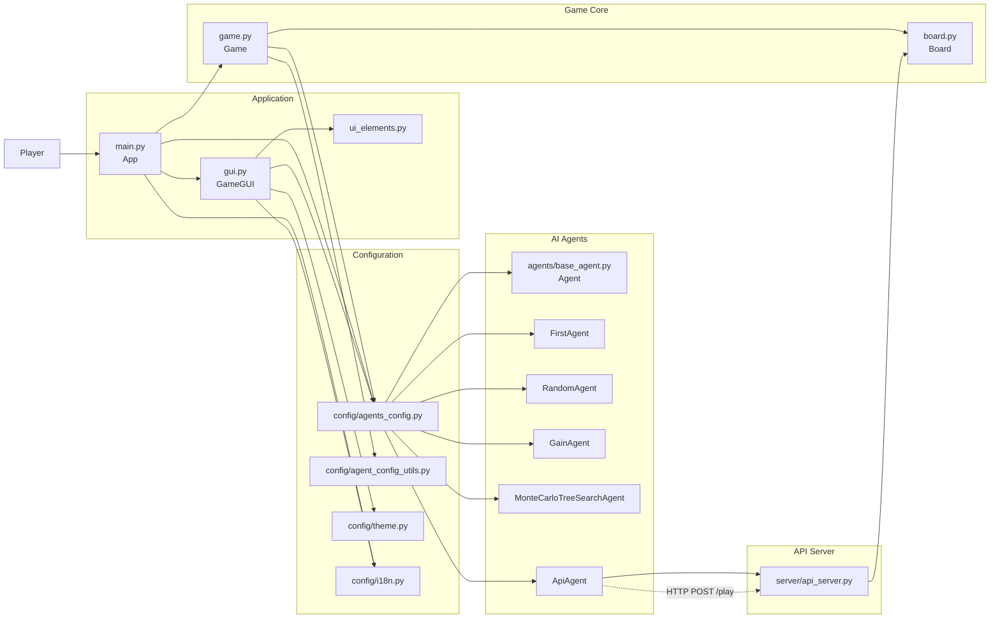

# Reversi (リバーシ) - Python / Pygame


## 概要

Python と Pygame で作られたリバーシゲームです。

- 人間 vs 人間、人間 vs AI、AI vs AI に対応
- 4 種類の AI エージェントを搭載
- 外部 API サーバー経由で着手する `API (Random)` エージェントを用意
- 履歴の巻き戻し、リスタート、リセット、パス処理に対応
- 日本語 UI とフォント設定に対応
- **包括的なテスト体制**: 227 テスト（アプリ + サーバー + 統合）、カバレッジ 99%
- **GitHub Actions CI**: Lint / 型チェック / テスト / カバレッジ / サーバーテスト / 統合テスト

## AI エージェント

プレイヤー設定では、次の選択肢を使えます。

- `人間`
- `First`
- `Random`
- `Gain`
- `MCTS`
- `API (Random)`

`API (Random)` は、`server/api_server.py` で起動する API サーバーから手を取得します。

## 構成図


```mermaid
flowchart LR
    User[Player]

    subgraph App["Application"]
        Main["main.py<br/>App"]
        GUI["gui.py<br/>GameGUI"]
        UIE["ui_elements.py"]
    end

    subgraph Core["Game Core"]
        Game["game.py<br/>Game"]
        Board["board.py<br/>Board"]
    end

    subgraph Agents["AI Agents"]
        Base["agents/base_agent.py<br/>Agent"]
        First["FirstAgent"]
        Random["RandomAgent"]
        Gain["GainAgent"]
        MCTS["MonteCarloTreeSearchAgent"]
        API["ApiAgent"]
    end

    subgraph Config["Configuration"]
        AgentsCfg["config/agents_config.py"]
        Params["config/agent_config_utils.py"]
        Theme["config/theme.py"]
        I18n["config/i18n.py"]
    end

    subgraph Server["API Server"]
        APIServer["server/api_server.py"]
    end

    User --> Main
    Main --> GUI
    Main --> Game
    Main --> I18n
    Main --> AgentsCfg

    GUI --> UIE
    GUI --> Theme
    GUI --> AgentsCfg
    GUI --> I18n

    Game --> Board
    Game --> AgentsCfg
    Game --> Params

    AgentsCfg --> Base
    AgentsCfg --> First
    AgentsCfg --> Random
    AgentsCfg --> Gain
    AgentsCfg --> MCTS
    AgentsCfg --> API

    API --> APIServer
    APIServer --> Board
    API -.->|HTTP POST /play| APIServer
```

## 動作環境

- Python 3.14.2 以上
- Pygame

API サーバーを使う場合は、追加で以下が必要です。

- FastAPI
- Pydantic
- Uvicorn

## インストール

基本環境を入れる場合:

```bash
uv sync
```

API サーバーも使う場合:

```bash
uv sync --extra server
```

開発用ツールも含めて全部入れる場合:

```bash
uv sync --all-extras
```

## クイックスタート

最もシンプルな起動方法：

```bash
./scripts/start.sh
```

API サーバー付きで起動（API エージェント使用可能）:

```bash
./scripts/start_with_server.sh
```

Docker で起動（VNC で操作）:

```bash
./scripts/docker_start.sh
```

## 実行方法

### Docker を使わない実行（ローカル環境）

#### 方法 1: アプリのみを起動（シンプル）

ゲーム本体をシンプルに起動します。この場合、ローカルの AI エージェント（First、Random、Gain、MCTS）のみが使用可能です。

**スクリプトを使う場合:**

```bash
./scripts/start.sh
```

**手動で起動する場合:**

```bash
# uv がインストール済みの場合
uv run python main.py

# Python を直接使う場合
python main.py
```

#### 方法 2: API サーバーとアプリを一緒に起動（API エージェント使用）

`API (Random)` エージェントを使う場合、API サーバーとアプリを起動します。

**スクリプトを使う場合（推奨）:**

```bash
./scripts/start_with_server.sh
```

このスクリプトは以下を自動で行います：
- API サーバーをバックグラウンドで起動
- サーバーの起動確認
- アプリケーションを起動
- 終了時に API サーバーも自動停止

**手動で起動する場合:**

ターミナル 1（API サーバー）:

```bash
# 環境設定（オプション）
export API_HOST=127.0.0.1  # デフォルト: 127.0.0.1
export API_PORT=5001       # デフォルト: 5001

# サーバー起動
uv run python -m server.api_server
```

ターミナル 2（アプリケーション）:

```bash
uv run python main.py
```

起動ログで `Uvicorn running on http://127.0.0.1:5001` が表示されたら正常です。API ドキュメントは http://127.0.0.1:5001/docs で確認できます。

アプリの「プレイヤー設定」でプレイヤーを `API (Random)` に設定すると、サーバー経由で AI が着手します。

### Docker を使用した実行（コンテナ環境）

Docker を使うと、依存関係やシステム設定に関わらず、どの環境でも同じ状態で実行できます。VNC を使って GUI を操作できます。

#### Docker イメージのビルド

イメージを構築します（初回のみ）。

```bash
docker build -t reversi-py .
```

または、スクリプトを使う場合（イメージの存在確認も行う）:

```bash
./scripts/docker_start.sh
```

#### Docker コンテナの起動

**スクリプトを使う場合（推奨）:**

```bash
./scripts/docker_start.sh
```

スクリプトは以下を行います：
- イメージを構築（存在しない場合）
- 既存コンテナを停止・削除
- コンテナを起動
- ポート設定情報を表示

**手動で起動する場合:**

```bash
docker run -d \
    --name reversi-container \
    -p 5901:5901 \
    -p 5001:5001 \
    -e DISPLAY=:1 \
    reversi-py
```

- `-d`: バックグラウンド実行
- `-p 5901:5901`: VNC ポート（ホスト:コンテナ）
- `-p 5001:5001`: API サーバーポート
- `-e DISPLAY=:1`: X11 ディスプレイ設定

#### VNC での GUI 接続

1. **VNC クライアントを起動**
   - macOS: Finder > 移動 > サーバーへ接続 > `vnc://localhost:5901`
   - Windows: TightVNC、RealVNC など
   - Linux: `vncviewer localhost:5901`

2. **接続情報**
   - ホスト: `localhost` または `127.0.0.1`
   - ポート: `5901`
   - パスワード: `reversi`（Dockerfile で設定）

3. **GUI 操作**
   - VNC 接続後は、ローカル実行と同様にゲームをプレイできます
   - API サーバーも同時に起動されています

#### コンテナの停止・削除

**スクリプトを使う場合:**

```bash
./scripts/docker_stop.sh
```

**手動で停止する場合:**

```bash
# コンテナを停止
docker stop reversi-container

# コンテナを削除
docker rm reversi-container
```

**すべての reversi コンテナを削除する場合:**

```bash
docker ps -a | grep reversi | awk '{print $1}' | xargs docker rm -f
```

#### コンテナ内でのトラブルシューティング

**ログを確認:**

```bash
docker logs -f reversi-container
```

**コンテナにシェルでアクセス:**

```bash
docker exec -it reversi-container bash
```

**API サーバーが起動しているか確認:**

```bash
# コンテナ内から
curl http://localhost:5001/docs

# ホストマシンから
curl http://localhost:5001/docs
```

#### 環境変数のカスタマイズ

Docker 起動時に環境変数を指定できます：

```bash
docker run -d \
    --name reversi-container \
    -p 5901:5901 \
    -p 5001:5001 \
    -e API_HOST=0.0.0.0 \
    -e API_PORT=5001 \
    -e LOG_LEVEL=debug \
    reversi-py
```

## API サーバー

API サーバーを起動すると、`API (Random)` エージェントが使えるようになります。

```bash
uv run python -m server.api_server
```

既定の設定は次のとおりです。

- ホスト: `127.0.0.1`
- ポート: `5001`
- ログレベル: `info`

必要に応じて、環境変数で変更できます。

- `API_HOST`
- `API_PORT`
- `LOG_LEVEL`

API ドキュメント:

- Swagger UI: `http://127.0.0.1:5001/docs`
- OpenAPI JSON: `http://127.0.0.1:5001/openapi.json`
- エンドポイント: `POST /play`

## 使い方

1. ゲームを起動します
   - シンプル実行: `./scripts/start.sh`
   - API サーバー付き: `./scripts/start_with_server.sh`
   - Docker 使用: `./scripts/docker_start.sh`

2. 画面の「ゲーム開始」ボタンを押します

3. 盤面の合法手をクリックして石を置きます

4. プレイヤー設定で以下を選べます
   - `人間`: 人間が手を指します
   - `First`, `Random`, `Gain`, `MCTS`: ローカル AI エージェント
   - `API (Random)`: API サーバー経由の AI（サーバー起動が必要）

5. `←` / `→` で履歴を戻したり進めたりできます

## テスト

### 全テストを実行

単体テストを実行します。

```bash
uv run pytest -q
```

期待: `227 passed, 5 subtests passed` （カバレッジ 99%）

### サーバー単体テスト

API サーバーのバリデーションテストを実行します（FastAPI TestClient 使用）。

```bash
uv run pytest tests/server/ -v
```

期待: `19 passed` （FastAPI エンドポイント、リクエスト・レスポンスの検証）

### 統合テスト

実際にサーバーを起動してエンドツーエンドテストを実行します。

```bash
uv run pytest tests/integration/ -v
```

期待: `9 passed` （API サーバーの実際の起動、ApiAgent との通信）

### ローカル CI チェック

ローカルで GitHub Actions 相当のすべてのチェックを実行します。

```bash
./scripts/ci_check.sh
```

実行内容:
1. Lint チェック (ruff)
2. 型チェック (mypy)
3. テスト実行 (pytest)
4. カバレッジ確認 (99%+)
5. サーバー単体テスト (FastAPI TestClient)
6. 統合テスト (実サーバー起動)

## 主要ファイル

### アプリケーション

- `main.py`: アプリケーションのエントリーポイント
- `game.py`: ゲーム進行、履歴、パス、勝敗判定
- `board.py`: 盤面ロジック
- `gui.py`: Pygame GUI
- `agents/`: AI エージェント実装
- `config/agents_config.py`: エージェント定義

### サーバー

- `server/api_server.py`: FastAPI REST API サーバー（エンドポイント: POST /play）

### テストと CI

- `tests/`: テストコード
  - `tests/server/test_api_server.py`: サーバー単体テスト（19 テスト、FastAPI TestClient）
  - `tests/integration/test_api_integration.py`: 統合テスト（9 テスト、実サーバー起動）
- `scripts/ci_check.sh`: ローカル CI チェックスクリプト（6 ステップ）
- `.github/workflows/ci.yml`: GitHub Actions 定義（4 ジョブ並列）


## 補足

- 合法手がない場合は自動でパスします。
- ゲームの進行や AI の着手ログはコンソールにも出力されます。

## ライセンス

MIT License です。詳細は `LICENSE` を参照してください。
