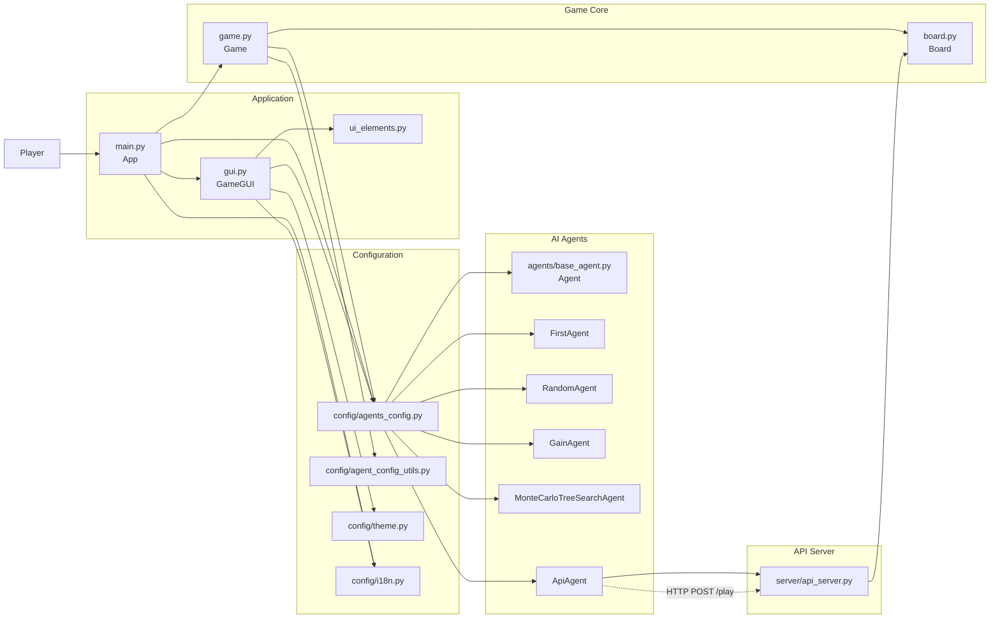

# Reversi (リバーシ) - Python / Pygame


## 概要

Python と Pygame で作られたリバーシゲームです。

- 人間 vs 人間、人間 vs AI、AI vs AI に対応
- 4 種類の AI エージェントを搭載
- 外部 API サーバー経由で着手する `API (Random)` エージェントを用意
- 履歴の巻き戻し、リスタート、リセット、パス処理に対応
- 日本語 UI とフォント設定に対応
- **包括的なテスト体制**: 227 テスト（アプリ + サーバー + 統合）、カバレッジ 99%
- **GitHub Actions CI**: Lint / 型チェック / テスト / カバレッジ / サーバーテスト / 統合テスト

## AI エージェント

プレイヤー設定では、次の選択肢を使えます。

- `人間`
- `First`
- `Random`
- `Gain`
- `MCTS`
- `API (Random)`

`API (Random)` は、`server/api_server.py` で起動する API サーバーから手を取得します。

## 構成図


```mermaid
flowchart LR
    User[Player]

    subgraph App["Application"]
        Main["main.py<br/>App"]
        GUI["gui.py<br/>GameGUI"]
        UIE["ui_elements.py"]
    end

    subgraph Core["Game Core"]
        Game["game.py<br/>Game"]
        Board["board.py<br/>Board"]
    end

    subgraph Agents["AI Agents"]
        Base["agents/base_agent.py<br/>Agent"]
        First["FirstAgent"]
        Random["RandomAgent"]
        Gain["GainAgent"]
        MCTS["MonteCarloTreeSearchAgent"]
        API["ApiAgent"]
    end

    subgraph Config["Configuration"]
        AgentsCfg["config/agents_config.py"]
        Params["config/agent_config_utils.py"]
        Theme["config/theme.py"]
        I18n["config/i18n.py"]
    end

    subgraph Server["API Server"]
        APIServer["server/api_server.py"]
    end

    User --> Main
    Main --> GUI
    Main --> Game
    Main --> I18n
    Main --> AgentsCfg

    GUI --> UIE
    GUI --> Theme
    GUI --> AgentsCfg
    GUI --> I18n

    Game --> Board
    Game --> AgentsCfg
    Game --> Params

    AgentsCfg --> Base
    AgentsCfg --> First
    AgentsCfg --> Random
    AgentsCfg --> Gain
    AgentsCfg --> MCTS
    AgentsCfg --> API

    API --> APIServer
    APIServer --> Board
    API -.->|HTTP POST /play| APIServer
```

## 動作環境

- Python 3.14.2 以上
- Pygame

API サーバーを使う場合は、追加で以下が必要です。

- FastAPI
- Pydantic
- Uvicorn

## インストール

基本環境を入れる場合:

```bash
uv sync
```

API サーバーも使う場合:

```bash
uv sync --extra server
```

開発用ツールも含めて全部入れる場合:

```bash
uv sync --all-extras
```

## 実行方法

### アプリのみを起動

ゲーム本体を起動します。

```bash
uv run python main.py
```

`python main.py` でも起動できます。

### サーバーとアプリを起動して通信させる

`API (Random)` エージェントを使う場合は、API サーバーとアプリを別々のターミナルで起動します。

**ターミナル 1: API サーバーを起動**

```bash
uv run python -m server.api_server
```

起動ログで `Uvicorn running on http://127.0.0.1:5001` が表示されたら正常です。API ドキュメントは http://127.0.0.1:5001/docs で確認できます。

**ターミナル 2: アプリを起動**

```bash
uv run python main.py
```

アプリの「プレイヤー設定」でプレイヤーを `API (Random)` に設定すると、サーバー経由で AI が着手します。

## API サーバー

API サーバーを起動すると、`API (Random)` エージェントが使えるようになります。

```bash
uv run python -m server.api_server
```

既定の設定は次のとおりです。

- ホスト: `127.0.0.1`
- ポート: `5001`
- ログレベル: `info`

必要に応じて、環境変数で変更できます。

- `API_HOST`
- `API_PORT`
- `LOG_LEVEL`

API ドキュメント:

- Swagger UI: `http://127.0.0.1:5001/docs`
- OpenAPI JSON: `http://127.0.0.1:5001/openapi.json`
- エンドポイント: `POST /play`

## 使い方

1. `uv run python main.py` でゲームを起動します。
2. 画面の「ゲーム開始」ボタンを押します。
3. 盤面の合法手をクリックして石を置きます。
4. プレイヤー設定で人間または AI を選べます。`API (Random)` を選ぶ場合は API サーバーを先に起動してください。
5. `←` / `→` で履歴を戻したり進めたりできます。

## テスト

### 全テストを実行

単体テストを実行します。

```bash
uv run pytest -q
```

期待: `227 passed, 5 subtests passed` （カバレッジ 99%）

### サーバー単体テスト

API サーバーのバリデーションテストを実行します（FastAPI TestClient 使用）。

```bash
uv run pytest tests/server/ -v
```

期待: `19 passed` （FastAPI エンドポイント、リクエスト・レスポンスの検証）

### 統合テスト

実際にサーバーを起動してエンドツーエンドテストを実行します。

```bash
uv run pytest tests/integration/ -v
```

期待: `9 passed` （API サーバーの実際の起動、ApiAgent との通信）

### ローカル CI チェック

ローカルで GitHub Actions 相当のすべてのチェックを実行します。

```bash
./scripts/ci_check.sh
```

実行内容:
1. Lint チェック (ruff)
2. 型チェック (mypy)
3. テスト実行 (pytest)
4. カバレッジ確認 (99%+)
5. サーバー単体テスト (FastAPI TestClient)
6. 統合テスト (実サーバー起動)

## 主要ファイル

### アプリケーション

- `main.py`: アプリケーションのエントリーポイント
- `game.py`: ゲーム進行、履歴、パス、勝敗判定
- `board.py`: 盤面ロジック
- `gui.py`: Pygame GUI
- `agents/`: AI エージェント実装
- `config/agents_config.py`: エージェント定義

### サーバー

- `server/api_server.py`: FastAPI REST API サーバー（エンドポイント: POST /play）

### テストと CI

- `tests/`: テストコード
  - `tests/server/test_api_server.py`: サーバー単体テスト（19 テスト、FastAPI TestClient）
  - `tests/integration/test_api_integration.py`: 統合テスト（9 テスト、実サーバー起動）
- `scripts/ci_check.sh`: ローカル CI チェックスクリプト（6 ステップ）
- `.github/workflows/ci.yml`: GitHub Actions 定義（4 ジョブ並列）

## Docker を使用した実行 (VNC 接続)

Docker がインストールされていれば、コンテナ内で GUI を起動し、VNC クライアントから操作できます。

```bash
docker build -t reversi-py .
docker run -d -p 5901:5901 --name reversi-container reversi-py
```

接続先は `localhost:5901` または `127.0.0.1:5901` です。

コンテナを停止・削除する場合:

```bash
docker stop reversi-container
docker rm reversi-container
```

## 補足

- 合法手がない場合は自動でパスします。
- ゲームの進行や AI の着手ログはコンソールにも出力されます。

## ライセンス

MIT License です。詳細は `LICENSE` を参照してください。
