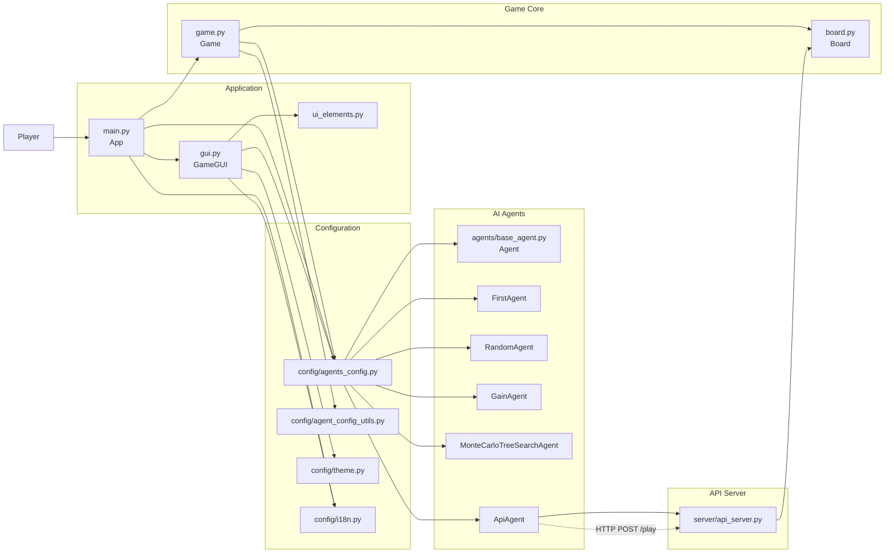

# Reversi (リバーシ) - Python / Pygame


## 概要

Python と Pygame で作られたリバーシゲームです。

- 人間 vs 人間、人間 vs AI、AI vs AI に対応
- 4 種類の AI エージェントを搭載
- 外部 API サーバー経由で着手する `API (Random)` エージェントを用意
- 履歴の巻き戻し、リスタート、リセット、パス処理に対応
- 日本語 UI とフォント設定に対応
- ユニットテストとローカル CI チェックを用意

## AI エージェント

プレイヤー設定では、次の選択肢を使えます。

- `人間`
- `First`
- `Random`
- `Gain`
- `MCTS`
- `API (Random)`

`API (Random)` は、`server/api_server.py` で起動する API サーバーから手を取得します。

## 構成図


```mermaid
flowchart LR
    User[Player]

    subgraph App["Application"]
        Main["main.py<br/>App"]
        GUI["gui.py<br/>GameGUI"]
        UIE["ui_elements.py"]
    end

    subgraph Core["Game Core"]
        Game["game.py<br/>Game"]
        Board["board.py<br/>Board"]
    end

    subgraph Agents["AI Agents"]
        Base["agents/base_agent.py<br/>Agent"]
        First["FirstAgent"]
        Random["RandomAgent"]
        Gain["GainAgent"]
        MCTS["MonteCarloTreeSearchAgent"]
        API["ApiAgent"]
    end

    subgraph Config["Configuration"]
        AgentsCfg["config/agents_config.py"]
        Params["config/agent_config_utils.py"]
        Theme["config/theme.py"]
        I18n["config/i18n.py"]
    end

    subgraph Server["API Server"]
        APIServer["server/api_server.py"]
    end

    User --> Main
    Main --> GUI
    Main --> Game
    Main --> I18n
    Main --> AgentsCfg

    GUI --> UIE
    GUI --> Theme
    GUI --> AgentsCfg
    GUI --> I18n

    Game --> Board
    Game --> AgentsCfg
    Game --> Params

    AgentsCfg --> Base
    AgentsCfg --> First
    AgentsCfg --> Random
    AgentsCfg --> Gain
    AgentsCfg --> MCTS
    AgentsCfg --> API

    API --> APIServer
    APIServer --> Board
    API -.->|HTTP POST /play| APIServer
```

## 動作環境

- Python 3.14.2 以上
- Pygame

API サーバーを使う場合は、追加で以下が必要です。

- FastAPI
- Pydantic
- Uvicorn

## インストール

基本環境を入れる場合:

```bash
uv sync
```

API サーバーも使う場合:

```bash
uv sync --extra server
```

開発用ツールも含めて全部入れる場合:

```bash
uv sync --all-extras
```

## 実行方法

ゲーム本体を起動します。

```bash
uv run python main.py
```

`python main.py` でも起動できます。

## API サーバー

API サーバーを起動すると、`API (Random)` エージェントが使えるようになります。

```bash
uv run python -m server.api_server
```

既定の設定は次のとおりです。

- ホスト: `127.0.0.1`
- ポート: `5001`
- ログレベル: `info`

必要に応じて、環境変数で変更できます。

- `API_HOST`
- `API_PORT`
- `LOG_LEVEL`

API ドキュメント:

- Swagger UI: `http://127.0.0.1:5001/docs`
- OpenAPI JSON: `http://127.0.0.1:5001/openapi.json`
- エンドポイント: `POST /play`

## 使い方

1. `uv run python main.py` でゲームを起動します。
2. 画面の「ゲーム開始」ボタンを押します。
3. 盤面の合法手をクリックして石を置きます。
4. プレイヤー設定で人間または AI を選べます。`API (Random)` を選ぶ場合は API サーバーを先に起動してください。
5. `←` / `→` で履歴を戻したり進めたりできます。

## テスト

単体テストを実行します。

```bash
uv run pytest -q
```

ローカルで CI 相当のチェックを実行します。

```bash
./scripts/ci_check.sh
```

## 主要ファイル

- `main.py`: アプリケーションのエントリーポイント
- `game.py`: ゲーム進行、履歴、パス、勝敗判定
- `board.py`: 盤面ロジック
- `gui.py`: Pygame GUI
- `agents/`: AI エージェント実装
- `config/agents_config.py`: エージェント定義
- `server/api_server.py`: API サーバー
- `tests/`: テストコード
- `scripts/ci_check.sh`: ローカル CI チェックスクリプト

## Docker を使用した実行 (VNC 接続)

Docker がインストールされていれば、コンテナ内で GUI を起動し、VNC クライアントから操作できます。

```bash
docker build -t reversi-py .
docker run -d -p 5901:5901 --name reversi-container reversi-py
```

接続先は `localhost:5901` または `127.0.0.1:5901` です。

コンテナを停止・削除する場合:

```bash
docker stop reversi-container
docker rm reversi-container
```

## 補足

- 合法手がない場合は自動でパスします。
- ゲームの進行や AI の着手ログはコンソールにも出力されます。

## ライセンス

MIT License です。詳細は `LICENSE` を参照してください。
